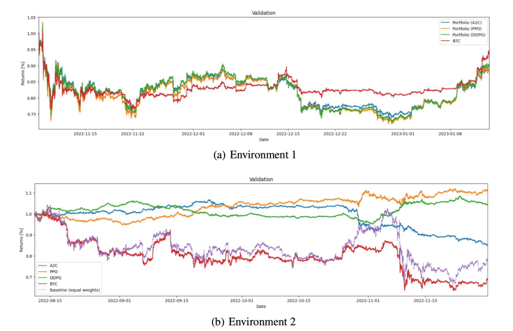
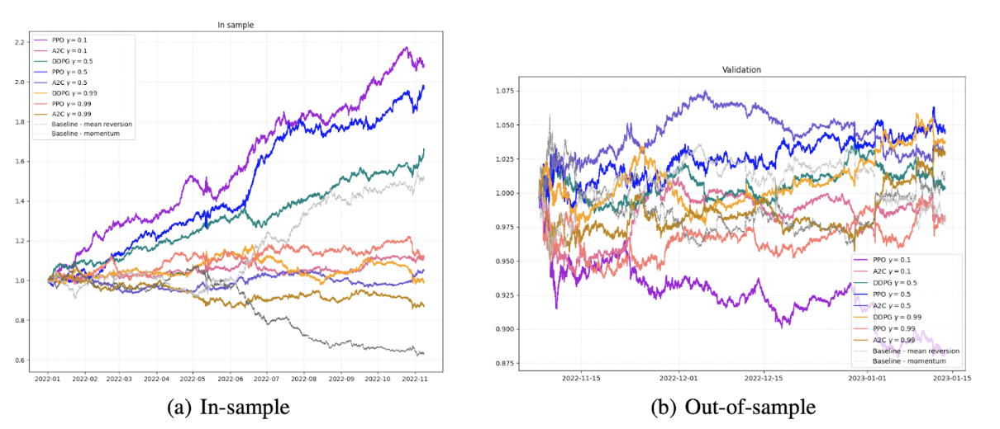

# Reinforecement Learning Project: Trading Cryptocurrencies
MIT 6.8200 Computational Sensorimotor Learning

## Problem Statement

Trading cryptocurrencies is challenging for traders and investors to discern the best strategies for optimising their portfolios. With the ever-changing dynamics of market conditions, even the advantage of hindsight does not always reveal the most effective trading policies. In this project, we explored the use of Reinforcement Learning to train agents to automate the entire trading process and ultimately determine if a profit can be made.

## Methodology and Approach

The dataset consisted of 16 cryptocurrencies with each row representing 5-minute intervals from 1st January 2022 to 19th March 2023. Features included close/open prices, high/low prices, volume, etc. The following parameters need to be defined for each environment:

- State: The set of input features and variables the agent receives at timestep, t, to make a decision. This is fed into a policy (neural network) to output an action vector
- Action: The output vector from the policy. The agent will execute the output action at timestep, t (e.g., buy, hold, or sell)
- Weights: A transformation (mapping) of the action
- Policy: A function that maps state to action (e.g., a neural network)
- Reward: The reward function from taking action, at at timestep, t (e.g., the returns from taking action at)

The full dataset was split into train-validation-test in the ratio of 70-15-15. We also defined two environments - a long only environment and a long and short environment. In the following table, Environment 1 denotes the long-only environment whereas Environment 2 denotes the long-short environment. The following table summarises their comparisons:

<table>
  <tr>
    <th>Parameters</th>
    <th>Environment 1</th>
    <th>Environment 2</th>
  </tr>
  <tr>
    <td><b>State, st</b></td>
    <td>Close prices and periodic returns</td>
    <td>Close prices, periodic returns, volume, volatility, RSI, MACD, exponential moving averages</td>
  </tr>
  <tr>
    <td><b>Action, at</b></td>
    <td colspan="2">16-dimensional vector of continuous values</td>
  </tr>
  <tr>
    <td><b>Weights, wt</b></td>
    <td>Softmax normalisation of at. All values between [0, 1] (e.g., 0.5 indicates allocate half of the funds to that crypto asset)</td>
    <td>Transforms at to be between [-1,1]. Negative indicates sell (short) positions. Positive indicates buy (long) positions.</td>
  </tr>
  <tr>
    <td><b>Policy</b></td>
    <td colspan="2">Neural Network mapping st to at</td>
  </tr>
  <tr>
    <td><b>Reward, rt</b></td>
    <td colspan="2">The portfolio value; multiply weights with ratio of close prices between timestep, t, and t-1</td>
  </tr>
</table>

## Results and Discussion
Owing partially to their ability to handle continuous value action spaces, we utilised Proximal Policy Optimisation (PPO), Advantage-Actor Critic (A2C), and Deep Deterministic Policy Gradients (DDPG).

- **Advantage-Actor Critic (A2C)**: The actor learns a policy to select the best action, while the critic estimates the value function to guide the actor’s learning. The actor-critic architecture allows for more stable learning, as the critic helps to reduce the variance in policy updates.

- **Proximal Policy Optimisastion (PPO)**: PPO, which combines TRPO’s sample efficiency and the simplicity of vanilla policy gradient methods, is particularly suited for cryptocurrency trading. Its policy constraint mechanism limits drastic policy updates, preventing large losses due to erratic changes. Given its success across various domains coupled with its inherent stability and efficiency, PPO shows potential for effective cryptocurrency portfolio management, balancing risk and returns.

- **Deep Deterministic Policy Gradients (DDPG)**: DDPG is an off-policy algorithm and uses a concept known as experience replay, which allows the agent to learn from past experiences, thereby maximizing its efficiency. Second, DDPG can handle continuous action spaces effectively, which are common in financial markets where buying and selling actions can take a range of values, not just binary decisions. Moreover, DDPG incorporates the actor-critic architecture, providing a balance between policy iteration and value iteration methods, and reducing the likelihood of policy degradation during updates.

Environment 2 outperformed Environment 1 (purely comparing the orange, green, and blue lines as those are the trained agents). In a long-only strategy, returns primarily rely on asset appreciation. However, our training dataset mainly covers the 2022 period, marked by significant declines in the cryptocurrency market. In such times, the optimal strategy for a long-only approach would involve holding cash during market downturns and selectively investing during upswings. But due to the softmax transformation applied to actions, the agent struggles to learn precise cash allocation during specific periods while allocating weights to different tokens in others. To address this, we propose using Environment 2, which allows partial positions in each token, providing a more suitable solution.

Note: In the figures, a return value exceeding 1.0 indicates we are profiting. From evaluating on the validation set, it was found that the PPO agent yielded the best results in terms of absolute profit and Sharpe ratio. A Sharpe ratio above 2 is generally considered good in finance. The agent successfully optimised its strategy to minimise losses and generate stable profits. The portfolio growth for most agents remained steady without significant downward shocks, demonstrating the agent's ability to limit volatility and reduce standard deviation in rewards. The DDPG strategy (dark green), although computationally intensive, showed potential for further improvement. With more training time, the DDPG agent could have potentially outperformed PPO. For testing, see section 4.3 of the report.

## Report
[6.8200 Final Report](./RL-Report.pdf)

## Notebooks
- 01-initial-baseline-trader.ipynb: An initial baseline trading strategy to compare against our RL agents
- 02-long-only-environment.ipynb: Environment 1 (long only)
- 03-all_trained_agents-long_short_environment.ipynb: Environment 2 (long and short)

